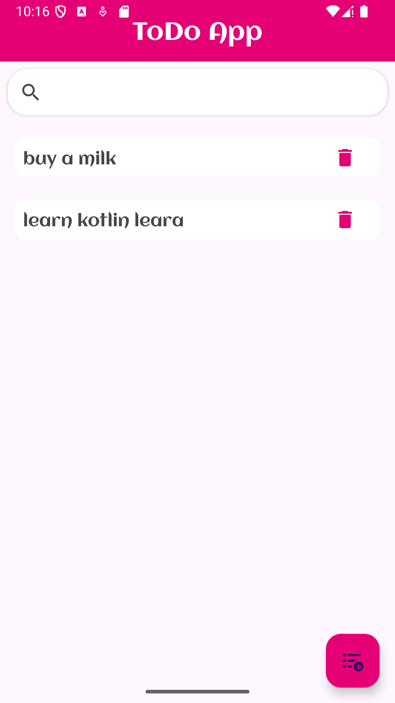
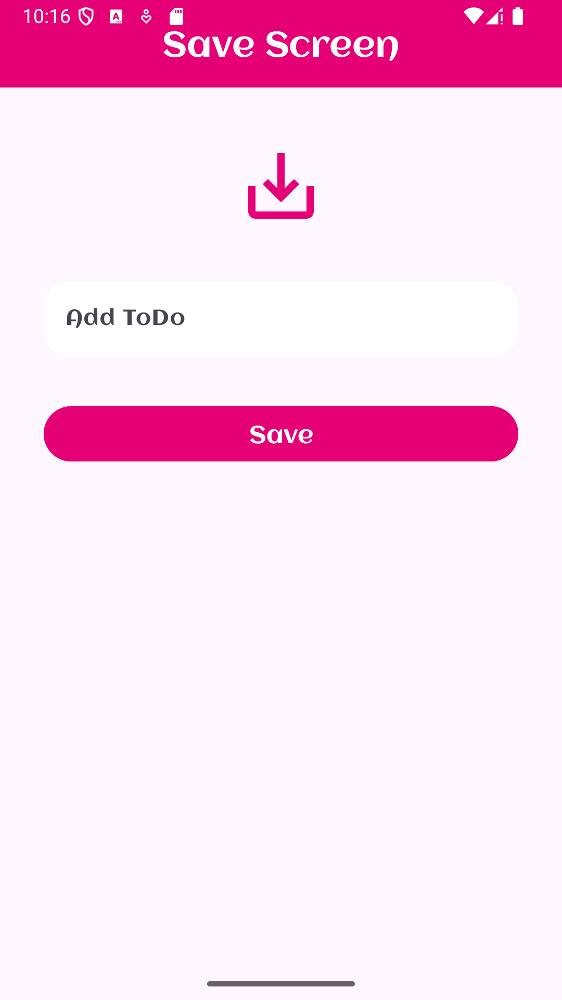
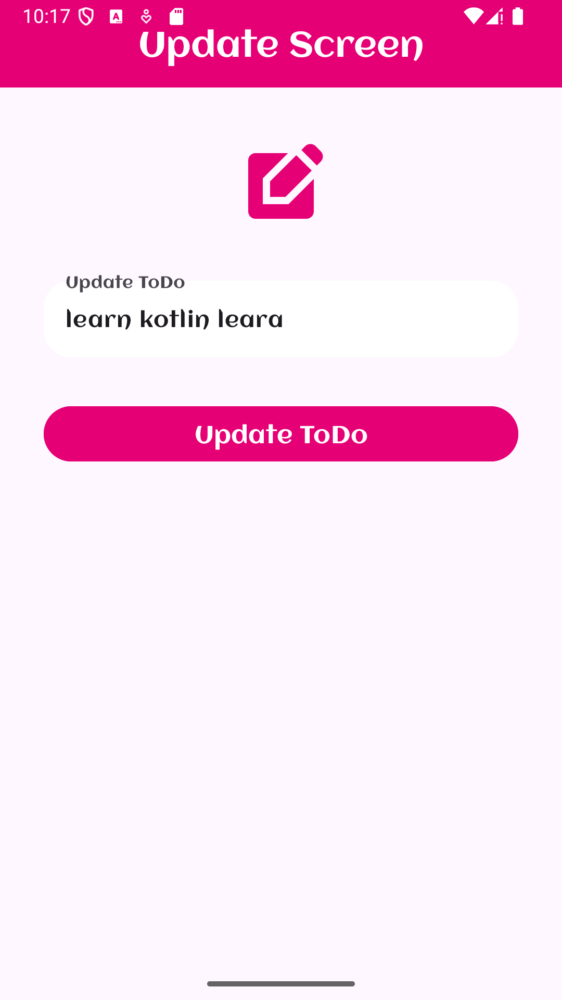

# Todo Uygulaması

## Genel Bakış
Todo Uygulaması, kullanıcıların günlük görevlerini yönetmelerine olanak tanıyan bir uygulamadır.
Uygulama Kotlin ve XML kullanılarak geliştirildi. Uygulama, görev oluşturma, güncelleme, silme ve arama gibi işlemleri kolay bir arayüzle sunar.
Modern Android mimari bileşenleri ve kütüphaneleri kullanılarak sağlam ve ölçeklenebilir bir kod tabanı oluşturulmuştur.

## Özellikler
- **Görev Yönetimi**: Görevleri kolayca oluşturun, güncelleyin ve silin.
- **Arama İşlevi**: Ana ekranda görevleri başlığa göre arayın.
- **Gezinme**: Android Jetpack Navigation ile ekranlar arasında akıcı geçiş.
- **Yerel Veritabanı**: Room ve SQLite ile görevleri yerel olarak saklama.
- **Kayan Eylem Düğmesi (FAB)**: Kaydet Ekranına (Save Screen)  ekranına hızlı geçiş sağlar.
- **Fragment Tabanlı Arayüz**: Modüler ve yeniden kullanılabilir ekranlar için Fragment'ler kullanıldı.

## Teknoloji Yığını
- **Dil**: Kotlin
- **Arayüz**: XML tabanlı düzenler
- **Mimari**: MVVM (Model-View-ViewModel)
- **Bağımlılıklar**:
  - Android Jetpack Navigation (`androidx.navigation.fragment.ktx`, `androidx.navigation.ui.ktx`)
  - Room (`androidx.room:room-runtime:2.7.2`, `androidx.room:room-ktx:2.7.2`, `androidx.room:room-compiler:2.7.2`)
  - Lifecycle Bileşenleri (`androidx.lifecycle:lifecycle-viewmodel:2.5.1`, `androidx.lifecycle:lifecycle-runtime-ktx:2.9.1`)
  - Activity KTX (`androidx.activity:activity-ktx:1.6.1`)
  - Hilt Bağımlılık Enjeksiyonu (`com.google.dagger:hilt-android:2.56.2`, `com.google.dagger:hilt-android-compiler:2.56.2`)

## Uygulama Yapısı
Uygulama aşağıdaki ekranlardan oluşur:
1. **Ana Ekran**: Görev listesini gösterir. Kullanıcılar:
   - Görevleri başlığa göre arayabilir.
   - FAB düğmesine tıklayarak "Kaydet Ekran (Save Ekran)" ekranına geçiş yapabilir.
   - Bir göreve tıklayarak "Güncelleme Ekran (Update Screen)" ekranına yönlendirilir.
   - Görevleri listeden doğrudan silebilir.
2. **Kaydet Ekranı (Save Screen)**: Yeni todo nesnesi   oluşturmayı sağlar.
3. **Güncelleme Ekran (Update Screen)**: Mevcut bir nesneyi  düzenlemeyi sağlar.

## Veritabanı
- Uygulama, yerel veri saklama için **Room** kütüphanesini kullanır ve SQLite üzerine inşa edilmiştir.
- **TodoDao**, görevler üzerinde CRUD işlemlerini gerçekleştirmek için kullanılır.

## Kurulum Talimatları
1. **Depoyu Klonlayın**:
   ```bash
   git clone https://github.com/musayar9/Kotlin_Android_ToDo_Homework.git
   ```
2. **Android Studio'da Açın**:
   - Projeyi Android Studio'da açın 
3. **Gradle Senkronizasyonu**:
   - Tüm bağımlılıkların senkronize edildiğinden emin olmak için "Sync Project with Gradle Files" seçeneğine tıklayın.
4. **Uygulamayı Çalıştırın**:
   - Bir Android cihaz veya emülatör bağlayın.
   - "Run" seçeneğiyle uygulamayı derleyin ve yükleyin.

## Ekran Görüntüleri
Aşağıda ekran görüntüleri için bir yer tutucu bulunmaktadır. Uygulamanın ekran görüntülerini buraya eklemek için görselleri depoya yükleyip bağlantılarını güncelleyebilirsiniz.






## Katkıda Bulunma
Katkılarınızı memnuniyetle karşılıyoruz! Lütfen şu adımları izleyin:
1. Depoyu fork edin.
2. Yeni bir dal oluşturun (`git checkout -b ozellik/yeni-ozellik`).
3. Değişikliklerinizi commit edin (`git commit -m 'Yeni özellik eklendi'`).
4. Dalı push edin (`git push origin ozellik/yeni-ozellik`).
5. Bir Pull Request açın.

## Lisans
Bu proje MIT Lisansı altında lisanslanmıştır - detaylar için [LICENSE](LICENSE) dosyasına bakın.